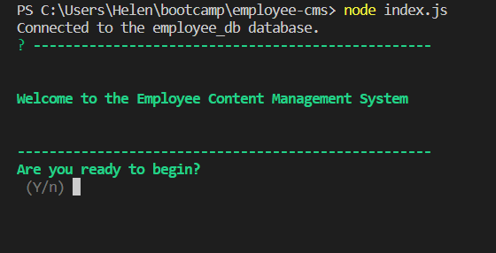
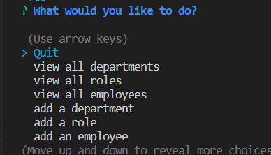
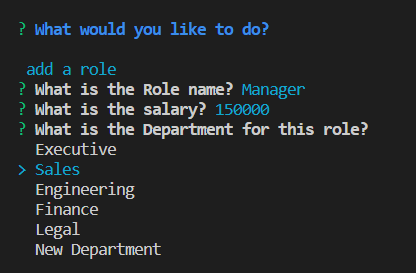
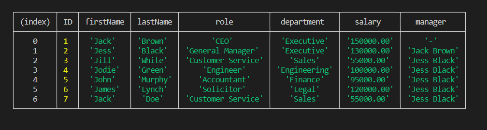
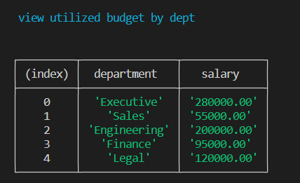

  # [](https://opensource.org/licenses/MIT)

  # Employee Content Management System (CMS)

  ## Table of Contents
 - [Description](#description)
 - [Installation](#installation)
 - [Usage](#usage)
 - [License](#license)
 - [Test Instructions](#test-instructions)
 - [Credits](#credits)
 - [Questions](#questions)
  
  ## Description
  This is a command-line application to manage a company's employee database, using Node.js, Inquirer, and MySQL. It allows a user to view employee, role and department data and add new employees, roles and departments. The user can also view employees by department or manager, update an employee role or manager and view the total utilized budget of all departments.

  Data is displayed in a tabular format, and the user is continuously prompted to carry out an action until they select to Quit.
  
  This is a node.js application which uses Inquirer to prompt the user for CMS details. MySQLs is used to carry out queries and updates and calls are done in an asynchronous fashion. The data is displayed in a tabular format using console.table package. Chalk is used to enhance the user interface.
  
  The application is developed using the following technologies:
  - javascript
  - node.js
  - Inquirer
  - MySQL2
  - console.table

  The main challenge in developing this application was getting the asynchronous functionality working. It also required familiarisation with sql.


  ## Installation
  Ensure node is installed. Test by running 
  ```
  node -v
  ```

  To install this package run:
  ```
  npm install
  ```

  ## Usage
  To run this application enter ensure you are in the main employee-cms directory. To start the application run:
```
node index.js
```
You should see the below welcome message:



You will be presented with a list of options as shown below. Scroll up and down and click return to choose an option.You can scroll in both directions.



Depending on what you choose you may be presented with a set of questions.



Data will be presented in tabular format eg employee data



Or Dept by utilized budget:




  ## License
  This project is covered by the "The MIT License" license.
  For more details click on the link below:
  [License](https://opensource.org/licenses/MIT)
  
  
  ## Test Instructions
  There are no specific tests for this application, just test by adding departments, roles and employees and then view the data to check its been added correctly.

  ## Credits
  I would like to thank the instructors at UWA Bootcamp. 
  
  ## Questions
 If you have any questions or feedback please contact me. My details are below. As this is a learning challenge for me I would appreciate any feedback, or ideas for improvement.

 Github : https://github.com/HelenELee 

 Email : helenelee3@outlook.com
  